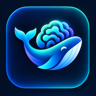
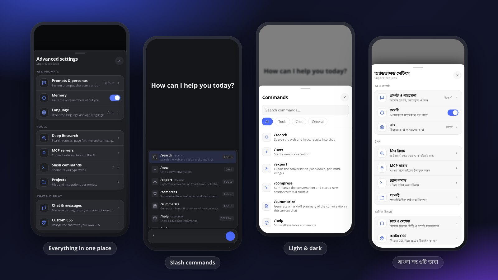

<div align="center">



# Super DeepSeek

**The official DeepSeek chat, supercharged, as a native Android app.**

Slash commands · memory · personas · MCP tools · Deep Research · code runners · one-tap exports

[](https://github.com/themuhammad-personal/Deepseek-/releases/latest/download/super-deepseek-latest.apk)
&nbsp;
[](https://github.com/themuhammad-personal/Deepseek-/releases)

[](https://github.com/themuhammad-personal/Deepseek-/actions/workflows/build-and-release-apk.yml)


[](LICENSE)



</div>

---

## Why Super DeepSeek?

Most "DeepSeek clients" re-implement a private API and break whenever it changes.
Super DeepSeek takes the opposite route: it runs **the real chat.deepseek.com** and adds
a powerful engine on top of it. Sign-in, models, DeepThink and web search work exactly as
DeepSeek ships them, and everything else is extra.

| | |
|---|---|
| 🧠 **It remembers you** | A memory library, personas and multiple system prompts, applied to every chat automatically. |
| ⚡ **Type less** | Type `/` for commands and your own snippets. Pick one, add details, send. |
| 🔌 **Plug in tools** | Connect remote MCP servers, and the AI discovers and calls their tools by itself. |
| 🔎 **Research deeply** | Multi-step Deep Research with page fetching, source ranking and a context guard. |
| 📦 **Take it with you** | Export any chat as Markdown, PDF, HTML or an image. Back up and restore all data in one file. |
| 📱 **Feels native** | Native file and camera picker, downloads, haptics, edge-to-edge layout, light and dark themes. |

## Features

<details open>
<summary><b>💬 Chat superpowers</b></summary>

- **Slash commands**: `/search`, `/new`, `/export`, `/compress`, `/summarize`, `/help`, plus
  your own commands mapped to saved snippets
- **Command palette and help sheet**: tap any command to drop it into the composer
- **Message queue**: keep typing while DeepSeek is still answering, and it sends when ready
- **Compress and hand off**: summarise a long chat and continue in a fresh one with full context
- Collapsible long messages, optional timestamps, chat tags, token cost estimates
</details>

<details>
<summary><b>🧠 Personal AI</b></summary>

- **Memory**: facts the AI keeps about you, with import from other assistants
- **Prompts and personas**: multi-system-prompt mode, characters and reusable skills
- **Projects**: per-project files and instructions injected when you need them
- **Language**: answer language and app language (English, বাংলা, فارسی, Русский, Türkçe, 中文)
</details>

<details>
<summary><b>🛠️ Tools the AI can use</b></summary>

- **MCP servers** over HTTP / Streamable HTTP, with optional API keys and ready-to-use tool discovery
- **Deep Research** with DuckDuckGo and Bing, configurable deep fetch and a token budget
- **Web, GitHub, X/Twitter and YouTube fetching** straight into the conversation
- **Code runners** for Python (Pyodide), JavaScript, TypeScript, Lua and Ruby, sandboxed
- **Documents and charts**: generate PowerPoint, Excel and Word files, and interactive charts
- **API playground** for the DeepSeek developer API, with history and presets
</details>

<details>
<summary><b>📱 Native Android shell</b></summary>

- Animated launch screen that stays until the page is fully ready, with no white flash
- Status and navigation bars follow the page's light or dark colour
- System file, gallery and camera pickers; downloads land in *Downloads*
- Haptic feedback and a keyboard-aware layout
- The **Back** button closes the open sheet, dialog or command popup first, then navigates
- **In-app updates** from GitHub Releases (stable or beta channel)
- Every build is signed with the same key, so new versions install as updates
</details>

## Install

1. Download **[super-deepseek-latest.apk](https://github.com/themuhammad-personal/Deepseek-/releases/latest/download/super-deepseek-latest.apk)** on your phone.
2. Open it and allow installing from this source when Android asks.
3. Sign in with your DeepSeek account. That's it.

Requires Android 8.0 (API 26) or newer. The app checks for updates itself; you can
switch between stable and beta builds in the update dialog.

## How it works

```
Android app ─▶ WebView: https://chat.deepseek.com (the real site)
                  └─ on load: inject the Super DeepSeek engine
                        injected.js  →  network layer (context, tools, memory)
                        content.css  →  styles
                        content.js   →  UI: drawer, settings, commands, cards
               AndroidBridge ⇄ native storage, pickers, downloads, haptics, updates
```

Because the chat surface *is* DeepSeek's own site, the app never needs your API key
and keeps working as DeepSeek evolves. Read the full design in
[docs/ARCHITECTURE.md](docs/ARCHITECTURE.md).

## Build from source

```bash
npm ci
npm run typecheck && npm run test:app     # workspace checks
npm run build:android                     # web assets → android/app/src/main/assets
rm -rf android/app/src/main/assets/bds && \
  cp -r android/app/src/main/bds-assets/bds android/app/src/main/assets/bds   # stage engine
cd android && ./gradlew testDebugUnitTest assembleRelease
```

CI (`.github/workflows/build-and-release-apk.yml`) runs the same steps, verifies the APK
signature and publishes releases. Pushing a `v*` tag creates a versioned release.

<details>
<summary><b>Project layout</b></summary>

| Path | What lives there |
|---|---|
| `android/app/src/main/java/…/app/` | Kotlin shell: `MainActivity`, `WebViewBridge`, `UiPolish`, `UpdateChecker` |
| `android/app/src/main/bds-assets/bds/` | The Super DeepSeek engine bundle (JS / CSS / sandbox) |
| `android/app/src/test/` | JVM unit tests for the shell |
| `docs/` | Architecture notes (`archive/` holds the retired SPA design) |
| `scripts/` | Build helpers, including `bds-sync.sh` (upstream diff, dry run by default) |
| `src/` | Legacy React SPA, still built into assets but no longer the chat surface |
</details>

## Privacy

Super DeepSeek has no servers and no analytics. Your chats go only to DeepSeek, as in
the official web app. Memory, prompts, snippets and settings are stored on your device.
Optional tools such as MCP servers, web fetching and GitHub only contact the services
you configure.

## Contributing

Issues and pull requests are welcome, especially translations, bug reports with
screenshots, and new commands or tools.
[Open an issue →](https://github.com/themuhammad-personal/Deepseek-/issues/new)

## License

[MIT](LICENSE). Super DeepSeek is an independent project and is not affiliated with
DeepSeek.

The launch screen uses the [Sora](https://github.com/sora-xor/sora-font) typeface under the
[SIL Open Font License 1.1](docs/licenses/Sora-OFL.txt).

---

<div align="center">
<sub>
Thanks to <a href="https://github.com/EdgeTypE/better-deepseek"><b>Better DeepSeek</b></a> by Çağrı DÜRÜ.
Super DeepSeek's engine began as that open-source extension. 💙
</sub>
</div>
